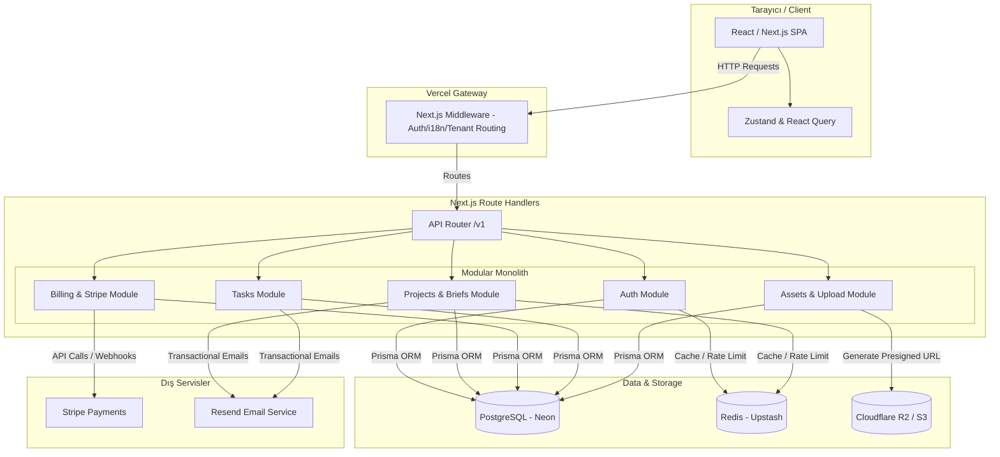
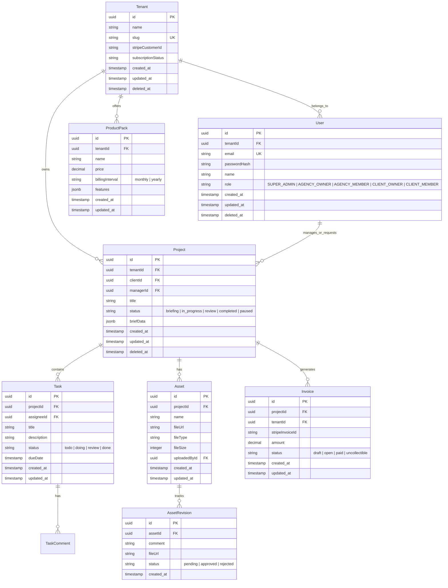

# ARCHITECTURE.md

## v1.0.0 — 09.06.2026

Bu belge, **StarWebFlow** projesinin teknik anayasasıdır. Projedeki tüm mimari, teknolojik ve operasyonel kararlar bu belgeye dayanır. Bu kararların dışına çıkılması ancak tanımlanmış **Break-Glass Protokolü** (Change Request) süreci ile mümkündür.

---

## 1. Ürün Analizi & Riskler

### Gerçek Problem
Dijital ajansların ölçeklenirken karşılaştığı operasyonel darboğazlar. Manuel müşteri alımı (onboarding), e-posta/Slack üzerinden dağınık giden briefler, revizyon süreçlerinin takibindeki zorluklar, düzensiz ödemeler (fatura/abonelik takibi) ve iş teslimatlarındaki gecikmeler. Müşteri tarafında ise şeffaflık eksikliği ve ajansın ne durumda olduğunu görememe (black-box agency) problemi.

### MVP Kapsamı
*   **Kesinlikle Dahil**:
    *   **Müşteri Portalı (Client Portal)**: Brief oluşturma, dosya yükleme, teslimatları görüntüleme ve revizyon talebi.
    *   **Ajans Paneli (Admin Portal)**: Brief yönetimi, proje atamaları, iş durum takibi (Kanban), dosya teslimi ve müşteri yönetimi.
    *   **Ödeme & Abonelik Entegrasyonu (Stripe)**: Hizmet paketleri satışı, aylık retainer/abonelik takibi ve otomatik faturalandırma.
    *   **Temel İletişim & Bildirim Sistemi**: Revizyon istendiğinde veya iş teslim edildiğinde e-posta/in-app bildirimleri.
*   **Kesinlikle Hariç**:
    *   AI ajansı otomasyonları (otomatik kod veya tasarım üretimi).
    *   Beyaz etiket (white-label) özel domain desteği (MVP sonrası fazlar için).
    *   Dahili gerçek zamanlı chat/video görüşme motoru (bunun yerine Slack veya e-posta entegrasyonu).
    *   Üçüncü parti proje yönetim araçlarıyla (Jira, Asana) çift yönlü tam senkronizasyon (başlangıçta tek yönlü webhook yeterli).

### Gizli Karmaşıklıklar
*   **Büyük Dosya Yönetimi ve Sürümleme**: Ajanslar yüksek çözünürlüklü tasarımlar, videolar veya zip dosyaları ile çalışır. Dosyaların versiyonlanması, her revizyonda hangi dosyanın güncel olduğunun takibi ve yüksek upload boyutları.
*   **Revizyon Döngüleri (Scope Creep)**: Müşterilerin bitmeyen revizyon talepleri. Sistemde revizyon haklarının sınırlandırılması (örn: paket başına 3 revizyon hakkı) ve bunun state olarak takibi.
*   **Tenant ve Rol Ayrımı**: Ajans çalışanları (designer, developer, PM), ajans sahipleri (admin) ve müşterilerin (client) farklı yetkilendirmelerle aynı projeyi farklı arayüzlerle görmesi.

### Kritik Varsayımlar
*   Müşterilerin Slack yerine portala girip brief yazmaya ikna olacağı varsayımı. (Eğer ikna olmazlarsa, e-posta veya Slack entegrasyonu üzerinden portala veri besleyen botlar yapılması gerekir).
*   Ajansların paket bazlı/abonelik (productized service) modeliyle çalışacağı varsayımı. (Eğer özel fiyatlandırma ağırlıklı çalışırlarsa faturalandırma modülünün dinamik teklif sistemine evrilmesi gerekir).

### En Tehlikeli 3 Teknik Risk
1.  **Yetkilendirme Sızıntısı (B2B Multi-tenancy Isolation Failure)**: A müşterisinin, B müşterisinin tasarımlarını, faturalarını veya brieflerini görmesi. (En kritik güvenlik riski).
2.  **Dosya Yükleme / Depolama Maliyeti Darboğazı**: Büyük dosyaların (video, tasarım kaynak dosyaları) doğrudan sunucu üzerinden yüklenmesi durumunda sunucu kaynaklarının tükenmesi veya CDN maliyetlerinin kontrolsüz artması.
3.  **Ödeme / Abonelik Senkronizasyon Kaybı (Webhook Failures)**: Stripe webhook'larının işlenememesi nedeniyle ödeme yapan müşterinin panelinin aktifleşmemesi veya tersi durumda iptal eden müşterinin servisi kullanmaya devam etmesi.

### Ölçekleme Eşiği
*   **İlk Faz (0 - 10.000 MAU)**: Tek veritabanı (PostgreSQL) ve tek bir Next.js Monolith sunucu (Vercel veya Docker on VPS/Render) yeterli olacaktır.
*   **Orta Faz (10.000 - 50.000 MAU)**: SQL read-replica'ların eklenmesi, Redis cache katmanının session ve sık sorgulanan dashboard verileri için devreye girmesi. Büyük upload'ların doğrudan AWS S3 veya Cloudflare R2'ye presigned URL ile yapılması.
*   **Büyük Ölçek (50.000+ MAU)**: Background worker'ların (örn. BullMQ) ana uygulamadan ayrılması, arama operasyonlarının Elasticsearch/Meilisearch'e taşınması.

### Domain-Spesifik Riskler
*   **Ajans & Müşteri İletişim Kayıtları**: Revizyon veya onay süreçlerindeki anlaşmazlıklar yasal risk yaratabilir. Tüm onay, teslimat ve revizyon geçmişinin "immutable audit log" olarak veritabanında saklanması gerekir.
*   **Race Conditions on Asset Access**: Dosya paylaşım linklerinin (presigned S3 URL) expire süreleri ve yetkisiz erişim kontrolü.

---

## 2. Teknoloji Kararları

*   **Frontend**
    *   **Seçilen**: Next.js (App Router, React, Tailwind CSS)
    *   **Neden**: SSR/ISR avantajları ile SEO gücü sağlarken, dinamik admin panelleri için zengin ve hızlı bir client-side React deneyimi sunması.
    *   **Alternatif**: Single Page App (Vite + React) — Elendi çünkü: SEO gereksinimlerini (landing page ve blog) ayrı bir sistemde barındırma maliyeti doğurur ve mimariyi böler.
*   **Backend**
    *   **Seçilen**: Next.js Route Handlers (Node.js/TypeScript)
    *   **Neden**: Modular Monolith yapısında frontend ve backend'i tek bir repoda tutarak MVP hızını maksimuma çıkarması ve tip güvenliğini (TypeScript) uçtan uca koruması.
    *   **Alternatif**: NestJS / Go — Elendi çünkü: Ekstra deployment karmaşıklığı yaratır, MVP aşamasında ayrı servis yönetimi ROI sağlamaz.
*   **Primary Veritabanı**
    *   **Seçilen**: PostgreSQL (Neon veya AWS RDS)
    *   **Neden**: İlişkisel verilerin (User, Tenant, Project, Invoice, Task) ACID garantisiyle saklanması ve olgun JSONB desteği sayesinde yarı-yapılandırılmış brief form verilerinin esnek yönetimi.
    *   **Alternatif**: MongoDB — Elendi çünkü: Finansal kayıtlar, ilişkisel roller ve veri bütünlüğü (Foreign Key constraints) bu domain için kritiktir; NoSQL veri tutarsızlığı riski yaratır.
*   **ORM**
    *   **Seçilen**: Prisma
    *   **Neden**: Güçlü TypeScript entegrasyonu, kolay şema migrasyon yönetimi ve ilişkisel sorgulardaki hızı.
    *   **Alternatif**: Drizzle ORM — Elendi çünkü: Prisma kadar olgunlaşmış şema ve migration araçlarına henüz sahip değil, ancak performans ihtiyacı arttığında CR ile değerlendirilebilir.
*   **Cache / Secondary DB**
    *   **Seçilen**: Redis (Upstash)
    *   **Neden**: Serverless Next.js ile tam uyumlu çalışan, rate limiting ve sık erişilen tenant konfigürasyonlarını cache'lemek için gerekli olan minimum karmaşıklıktaki yapı.
    *   **Alternatif**: Memcached — Elendi çünkü: Pub/sub ve queue (BullMQ gibi) yetenekleri olmadığı için ilerideki asenkron işler için yetersiz kalır.
*   **Auth**
    *   **Seçilen**: Auth.js (NextAuth.io) + JWT-based sessions
    *   **Neden**: Google OAuth ve Email/Password (Magic Link) gibi modern auth yöntemlerini hazır sunması ve Next.js middleware ile entegre çalışması.
    *   **Alternatif**: Clerk / Auth0 — Elendi çünkü: Dış bağımlılık maliyeti ve veri sahipliği kısıtlamaları MVP bütçesini zorlar.
*   **File Storage**
    *   **Seçilen**: Cloudflare R2 / AWS S3 (Presigned URL Uploads)
    *   **Neden**: Sınırsız dosya boyutu desteği, ucuz depolama ve sunucuyu yormadan doğrudan tarayıcıdan upload (Presigned URL) imkanı sunması.
    *   **Alternatif**: Sunucu lokal diski — Elendi çünkü: Next.js sunucularını stateless (ephemeral) olmaktan çıkarır ve yatay ölçeklemeyi engeller.
*   **Hosting / Deployment**
    *   **Seçilen**: Vercel veya Docker on Railway/Render
    *   **Neden**: Sıfır ops maliyeti, kolay CI/CD ve preview deployment'lar sayesinde geliştirme hızını katlaması.
    *   **Alternatif**: AWS EKS / Kubernetes — Elendi çünkü: MVP için aşırı karmaşık ve yüksek bakım maliyetine sahip.
*   **Kritik 3rd Party Entegrasyonları**
    *   **Stripe**: Abonelik ve ödeme altyapısı için endüstri standardı.
    *   **Resend**: Transactional e-postalar için yüksek teslim edilebilirlik ve developer dostu API.

---

## 3. Architecture Contract

Bu bölüm tüm geliştiricileri bağlar. Değişiklik gerekiyorsa önce bu dosya güncellenmelidir.

### [ AUTH ]
*   **Yöntem**: Auth.js tabanlı JWT (JSON Web Token) Session. JWT'ler sunucuda state tutma ihtiyacını ortadan kaldırır ve edge runtime'da hızlı doğrulanır.
*   **Token Storage**: Güvenli `httpOnly`, `secure`, `sameSite: lax` cookie'leri. Bu yöntem, token'ın JavaScript kodları (XSS saldırıları) tarafından okunmasını engeller.
*   **Refresh Stratejisi**: JWT expire süresi 1 gündür. Her Next.js middleware kontrolünde, token ömrünün bitmesine 4 saat kala otomatik olarak arka planda token yenilenir.
*   **Rol Modeli (RBAC)**:
    *   `SUPER_ADMIN`: Sistem genelindeki ajansları ve faturaları yönetir.
    *   `AGENCY_OWNER`: Kendi ajansını, üyelerini, paketlerini ve faturalarını yönetir.
    *   `AGENCY_MEMBER`: Atandığı projeleri ve görevleri görür, dosya yükler, yorum yapar.
    *   `CLIENT_OWNER`: Kendi şirketi adına proje açar, brief yazar, ödeme yapar, teslimatları onaylar.
    *   `CLIENT_MEMBER`: Sadece projeleri görüntüler, brief yazabilir ama fatura/ödeme detaylarını göremez.

### [ API ]
*   **Stil**: REST API (Next.js Route Handlers).
*   **Versioning**: `/api/v1/` prefix'i kullanılacaktır. Örn: `/api/v1/projects`.
*   **Error Format**: Tüm API endpoint'leri hata durumunda aşağıdaki standart JSON yapısını dönecektir:
    ```json
    {
      "success": false,
      "error": {
        "code": "VALIDATION_FAILED",
        "message": "Gönderilen brief verileri geçersiz.",
        "details": [
          { "field": "title", "issue": "Başlık en az 5 karakter olmalıdır." }
        ]
      }
    }
    ```
*   **Pagination**: Standart olarak **Cursor-based Pagination** kullanılacaktır.
    *   Request: `/api/v1/projects?limit=10&cursor=eyJpZCI6MTJ9`
    *   Response:
        ```json
        {
          "success": true,
          "data": [...],
          "pagination": {
            "nextCursor": "eyJpZCI6MjJ9",
            "hasNextPage": true
          }
        }
        ```

### [ FRONTEND ]
*   **State Management**: Global UI State için **Zustand**, Server State için **TanStack Query (React Query)** kullanılacaktır. Formlarda **React Hook Form + Zod** validation zorunludur.
*   **Data Fetching**: Axios veya Native `fetch` sarmalayıcısı (TanStack Query ile birlikte).
*   **Error Boundary**: Global seviyede `app/[locale]/error.tsx` ve kritik dashboard widget'ları çevresinde lokal `ErrorBoundary` bileşenleri kullanılacaktır.

### [ BACKEND ]
*   **Mimari Tipi**: **Modular Monolith**. Kod tabanı işlevsel modüllere bölünür. Modüller sadece tanımlı servis API'leri üzerinden haberleşebilir.
*   **Logging**: Production ortamında JSON log formatında (örn. Pino kütüphanesi ile) Vercel Logs / Axiom sistemine yazılır.
*   **Validation**: Controller (Route Handler) girişinde (Request Body validation) ve Service katmanında (Business logic validation) **Zod** ile yapılacaktır.

### [ NAMING STANDARDS ]
*   Dosya adı: `kebab-case.ts` / `kebab-case.tsx`
*   Klasör adı: `kebab-case`
*   Component: `PascalCase.tsx`
*   Hook: `useResourceAction.ts` (örn: `useProjectCreate.ts`)
*   Service: `ResourceService.ts` (örn: `ProjectService.ts`)
*   API route: `/api/v1/resource-name` (örn: `/api/v1/project-briefs`)

---

## 4. Mimari Diagram



---

## 5. Veritabanı ERD



### Tablo Listesi & Sorumlulukları
1.  **Tenant**: Sistemi kullanan ajans yapısını temsil eder. Multi-tenant izolasyonunun en üst seviyesidir.
2.  **User**: Sistemdeki tüm kullanıcıları (ajans sahipleri, çalışanlar ve müşteriler) ve rollerini tutar.
3.  **ProductPack**: Ajansın müşterilerine sunduğu abonelik veya tek seferlik hizmet paketlerini tutar.
4.  **Project**: Başlatılan işleri, bunlara ait brief verilerini (JSONB) ve projenin genel durumunu yönetir.
5.  **Task**: Proje altındaki iş parçacıklarını, atanan kişiyi ve teslim tarihlerini takip eder.
6.  **Asset**: Projeye yüklenen kaynak dosyaları, tasarımları ve belgeleri saklar.
7.  **AssetRevision**: Yüklenen tasarım veya dosyalar üzerindeki geri bildirim ve revizyon döngülerini tutar.
8.  **Invoice**: Müşteriye kesilen faturaları ve ödeme durumlarını tutar.

### Kritik Indexler & Gerekçeleri
*   `idx_users_email` (Unique): Auth doğrulamalarında e-posta ile hızlı kullanıcı bulmak için.
*   `idx_tenants_slug` (Unique): Subdomain veya özel URL yönlendirmelerinde Tenant'ı anında sorgulamak için.
*   `idx_projects_tenant_id`: Multi-tenant veri izolasyonu sorgularında veritabanının tüm tabloyu taramasını engellemek için.
*   `idx_tasks_project_id`: Bir projenin altındaki görevleri listelerken performans kaybını önlemek için.
*   `idx_assets_project_id`: Proje teslimatlarının ve kaynak dosyalarının hızlıca listelenmesi için.

### Multi-Tenant İzolasyon Stratejisi
*   **Mantıksal İzolasyon (Shared Database, Shared Schema)**: MVP aşaması için maliyet ve bakım kolaylığı açısından en uygun yöntemdir.
*   **Uygulama Güvencesi**: Her SQL sorgusunda ve API endpoint'inde middleware/context üzerinden gelen `tenantId` zorunlu bir WHERE koşulu olarak eklenecektir. Prisma extension'ları kullanılarak `tenantId` filtrelemesi otomatik olarak sorgulara enjekte edilecek ve veri sızıntısı riski ortadan kaldırılacaktır.

---

## 6. API Standartları

### Endpoint Tablosu

| Method | Path | Açıklama | Auth? | Rol | Rate Limit |
|--------|------|----------|-------|-----|------------|
| `POST` | `/api/v1/auth/login` | Kullanıcı girişi ve session oluşturma | Hayır | Herkes | 10 req/min |
| `POST` | `/api/v1/auth/logout` | Session sonlandırma | Evet | Herkes | 30 req/min |
| `GET` | `/api/v1/projects` | Tenant'a ait projeleri listeler | Evet | `CLIENT_MEMBER` ve üzeri | 100 req/min |
| `POST` | `/api/v1/projects` | Yeni proje ve brief oluşturur | Evet | `CLIENT_OWNER`, `AGENCY_OWNER` | 20 req/min |
| `GET` | `/api/v1/projects/{id}`| Proje detaylarını ve brief'i getirir | Evet | `CLIENT_MEMBER` ve üzeri | 150 req/min |
| `PUT` | `/api/v1/projects/{id}`| Proje durumunu veya brief'i günceller | Evet | `AGENCY_MEMBER` ve üzeri | 50 req/min |
| `GET` | `/api/v1/projects/{id}/tasks` | Projeye bağlı task'leri listeler | Evet | `CLIENT_MEMBER` ve üzeri | 150 req/min |
| `POST` | `/api/v1/projects/{id}/tasks` | Projeye yeni task ekler | Evet | `AGENCY_MEMBER` ve üzeri | 50 req/min |
| `POST` | `/api/v1/projects/{id}/assets` | S3 Presigned URL talep eder | Evet | `CLIENT_MEMBER` ve üzeri | 30 req/min |
| `POST` | `/api/v1/assets/{id}/revisions` | Dosyaya revizyon veya onay ekler | Evet | `CLIENT_OWNER` (onay için) | 30 req/min |
| `GET` | `/api/v1/billing/invoices` | Tenant faturalarını listeler | Evet | `CLIENT_OWNER`, `AGENCY_OWNER` | 50 req/min |

### Standart Response Formatları

*   **Error Response (Örnek - HTTP 400)**:
    ```json
    {
      "success": false,
      "error": {
        "code": "BAD_REQUEST",
        "message": "Validation failed",
        "details": [
          {
            "field": "title",
            "issue": "Title is required and must be at least 3 characters."
          }
        ]
      }
    }
    ```

*   **Paginated Response (Örnek - HTTP 200)**:
    ```json
    {
      "success": true,
      "data": [
        {
          "id": "c3a9d5e2-2f3b-4c1d-8e9f-0a1b2c3d4e5f",
          "title": "StarWebFlow Website Redesign",
          "status": "in_progress"
        }
      ],
      "pagination": {
        "nextCursor": "eyJpZCI6ImMzYTlkNWUyLTJmM2ItNGMxZC04ZTlmLTBhMWIyYzNkNGU1ZiJ9",
        "hasNextPage": true
      }
    }
    ```

---

## 7. Dosya Yapısı

```
src/
├── app/                  # Next.js App Router Pages & Layouts
│   ├── [locale]/         # Çoklu dil (i18n) desteği için lokalize sayfalar
│   │   ├── admin/        # Ajans Paneli sayfaları
│   │   ├── client/       # Müşteri Portalı sayfaları
│   │   └── page.tsx      # Landing page
│   └── api/              # API Route Handler katmanı (/api/v1/...)
│       └── v1/
│           ├── auth/
│           ├── projects/
│           └── billing/
├── components/           # UI Bileşenleri
│   ├── ui/               # Temel atomik UI elemanları (Button, Input vb.)
│   ├── premium/          # Şık ve premium özel tasarım bileşenleri (Gradient vb.)
│   └── shared/           # Sayfalar arası paylaşılan kompleks bileşenler
├── lib/                  # Shared Utility ve Third Party konfigürasyonları
│   ├── prisma.ts         # Tekil Prisma client instance'ı
│   ├── stripe.ts         # Stripe client yapılandırması
│   └── utils.ts          # Yardımcı saf fonksiyonlar (date format, class birleştirme)
├── modules/              # İş Mantığı Modülleri (Modular Monolith)
│   ├── auth/
│   │   ├── auth.service.ts
│   │   └── auth.types.ts
│   ├── projects/
│   │   ├── project.service.ts
│   │   └── project.schema.ts
│   └── billing/
│       ├── billing.service.ts
│       └── billing.schema.ts
└── middleware.ts         # JWT Session kontrolü ve Multi-tenant routing yönetimi
```

### Modül Sınırları Kuralları
1.  Modüller arası doğrudan iç import (`import {...} from '../billing/internal-helper'`) yasaktır.
2.  Modüller arası tüm iletişim sadece modülün ana servis sınıfı (`BillingService`) üzerinden gerçekleştirilmelidir.
3.  Test dosyaları, test ettikleri hedef dosyalarla aynı klasörde (`projects/project.service.spec.ts`) yer almalıdır.

---

## 8. Dependency Matrix & Implementation Planı

### Dependency Matrix

| Modül | Bağımlı Olduğu Modüller | Risk Seviyesi | Risk Açıklaması |
|-------|------------------------|---------------|-----------------|
| **Auth** | Yok | `KRİTİK` | Tüm sistemin giriş kapısı ve RBAC güvenliği |
| **Billing** | Auth | `KRİTİK` | Ödeme akışları ve faturalandırma tutarlılığı |
| **Projects** | Auth | `NORMAL` | Brief ve proje veri bütünlüğü |
| **Tasks** | Projects, Auth | `NORMAL` | Proje içi atamalar ve durum güncellemeleri |
| **Assets** | Projects, Auth | `NORMAL` | S3 yetkilendirmesi ve dosya erişim güvenliği |
| **Notifications**| Projects, Tasks, Auth | `BASİT` | E-posta ve in-app bildirim gönderimi |

### Implementation Sırası

| Sıra | Modül | Bağımlılıkları | Complexity | Katman | Açıklama |
|------|-------|----------------|------------|--------|----------|
| 1 | **Auth & Tenant Init** | Yok | Yüksek | 3 Katman (Kritik) | Veritabanı şemasının ayağa kalkması ve ilk kullanıcı/tenant oluşturma akışları |
| 2 | **Projects & Briefs**| Auth | Orta | 2 Katman (Normal) | Temel iş modelinin (brief doldurma ve proje açma) kurulması |
| 3 | **Tasks & Flow** | Projects, Auth | Orta | 2 Katman (Normal) | Kanban yapısının ve iş atamalarının yapılması |
| 4 | **Billing & Stripe** | Auth | Yüksek | 3 Katman (Kritik) | Stripe webhook'ları, abonelik başlatma ve fatura entegrasyonu |
| 5 | **Assets & Revisions**| Projects, Auth | Orta | 2 Katman (Normal) | Dosya upload presigned URL entegrasyonu ve revizyon onay döngüleri |
| 6 | **Notifications** | Diğer tüm modüller | Düşük | 1 Katman (Basit) | E-posta şablonları ve in-app bildirim altyapısı |

---

## 9. Break-Glass Protokolü (Mimari Değişiklik Süreci)

Architecture Contract bir kez yazılır ve bağlayıcıdır. Değişiklik gerektiğinde bu süreci takip et:

### Change Request (CR) Tetikleyiciler
Şu durumlarda CR açılır — bunlar dışında contract değiştirilemez:
*   **Performans darboğazı**: Ölçülebilir metrik eşiği aşıldı (örn: "p95 latency > 2s, profiler N+1 query'yi işaret ediyor").
*   **Teknolojik zorunluluk**: Seçilen teknoloji kritik bir özelliği desteklemiyor.
*   **Güvenlik açığı**: Mevcut kararın güvenlik riski kanıtlandı.
*   **Ölçekleme kırılması**: Mevcut mimari beklenen yükü taşıyamıyor.

### CR Formatı
```
┌─────────────────────────────────────────┐
│ CHANGE REQUEST #[N]                     │
├─────────────────────────────────────────┤
│ Tarih        : [tarih]                  │
│ Tetikleyen   : [hangi modül / senaryo]  │
│ Mevcut karar : [contract'taki karar]    │
│ Problem      : [kanıtla — metrik/hata]  │
│ Önerilen     : [yeni karar]             │
│ Alternatifler:                          │
│   A) [seçenek] — tradeoff: [...]        │
│   B) [seçenek] — tradeoff: [...]        │
│ Etkilenen modüller: [liste]             │
│ Geri alma planı: [nasıl geri alınır?]   │
└─────────────────────────────────────────┘
```

### CR Kuralları
1.  Model CR olmadan contract'ı değiştiremez.
2.  "Daha iyi olur" gerekçesi CR açmaz — somut kanıt gerekir.
3.  Onay verilirse: `ARCHITECTURE.md` güncellenir, versiyon artar (v1 → v2).
4.  Etkilenen tüm modüller yeniden gözden geçirilir.
5.  CR geçmişi `ARCHITECTURE.md`'nin sonunda saklanır.

---

## 10. Change Request Geçmişi

*(Başlangıçta boş)*
