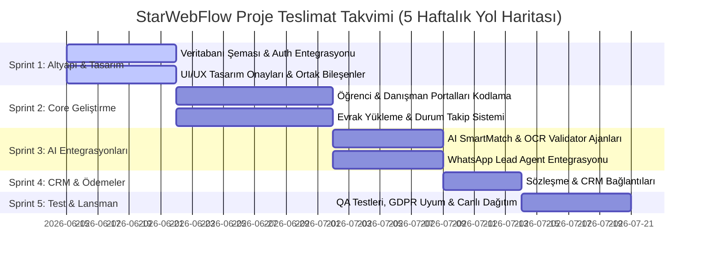

# STARWEBFLOW
## TEKNİK ŞARTNAME BELGESİ (LASTENHEFT)
### Konsept & Mimari Gereksinimler Raporu
#### AI Destekli Otomasyon & Web Ekosistemi Taslağı

---

### PROJE KÜNYESİ
*   **Müşteri / Kurum:** İhsan (Yurtdışı Eğitim & Kariyer Danışmanlığı)
*   **Düzenlenme Tarihi:** 15 Haziran 2026
*   **E-Posta Adresi:** ihsaninan34@gmail.com
*   **Hazırlayan Ajans:** StarWebFlow Architecture Studio

---

## 1. PROJE VİZYONU & DEĞER ODAKLI STRATEJİK ANALİZ

Müşterimiz İhsan tarafından iletilen vizyon, *"Yurtdışı eğitim firması için modern bir web sitesi ve bunun için gerekli yapay zeka (AI) otomasyonları ile otonom ajanların (AI Agents) kurulması"* olarak tanımlanmıştır. 

StarWebFlow analitik ekibi, bu vizyonu sadece statik bir web sitesi olarak değil; **gelir artırıcı, operasyonel iş yükünü minimize eden ve sektörel rekabette öncü konumlandırma sağlayan bütünsel bir "Dijital İş Ekosistemi"** olarak tasarlamıştır.

### A. Sektörel Acı Noktaları ve Çözüm Yaklaşımı

Yurtdışı eğitim danışmanlığı sektörünün en büyük operasyonel darboğazları ve bu sistemle nasıl çözüleceği aşağıda özetlenmiştir:

1.  **Lead (Potansiyel Müşteri) Kaçırma Problemi:** Web sitesine gece veya hafta sonu gelen başvuruların geç yanıtlanması, adayların rakip firmalara kaymasına neden olur. 
    *   *StarWebFlow Çözümü:* **7/24 Aktif AI WhatsApp ve Web Ajanı** sayesinde, sisteme düşen her talep 5 saniye içinde doğal dilde karşılanır, ön eleme soruları sorulur ve danışmanların önüne "sıcak fırsat" olarak düşer.
2.  **Manuel Transkript ve Uygunluk İncelemesi:** Bir adayın akademik profiline (not ortalaması, dil skoru, bütçe) en uygun okulları ve vize başarı şansını analiz etmek danışmanların saatlerini alır.
    *   *StarWebFlow Çözümü:* **AI SmartMatch Engine**, saniyeler içinde adayın kriterlerini 500+ küresel okulun kabul şartlarıyla kıyaslar ve en yüksek kabul olasılığına sahip 3 programı gerekçeli raporuyla sunar.
3.  **Hatalı ve Eksik Evrak Süreçleri:** Öğrencilerin pasaport, IELTS belgesi veya transkriptlerini eksik/yanlış yüklemesi yüzünden başvuru süreçleri haftalarca tıkanabilir.
    *   *StarWebFlow Çözümü:* **AI Document Validator**, yüklenen evrakları OCR teknolojisiyle anında okur, ad-soyad uyuşmazlığını, geçerlilik sürelerini ve eksik imzaları danışmanın kontrolüne gerek kalmadan tespit ederek öğrenciye anında geri bildirim verir.
4.  **Müşteride Güven ve Şeffaflık Eksikliği:** Öğrencinin başvurusunun hangi aşamada olduğunu bilmemesi, danışmanları sürekli arama/mesaj atma yükü altında bırakır.
    *   *StarWebFlow Çözümü:* **Transparan Süreç Takip Paneli** ile öğrenciler kabullerini, vize durumlarını ve konaklama adımlarını kargo takip şeffaflığında izler. Durum değişiklikleri otomatik e-posta ve WhatsApp mesajlarıyla bildirilir.

---

## 2. ÖNERİLEN FONKSİYONEL MODÜLLER

### 1. Modern Kullanıcı Yönetimi (RBAC & Multi-Tenancy)
*   **Güvenli Giriş Altyapısı:** En yüksek güvenlik standartlarına sahip JWT ve Google OAuth 2.0 entegrasyonu. `httpOnly` cookie yapısı ile XSS saldırılarına karşı tam koruma.
*   **Rol Hiyerarşisi (Role-Based Access Control):** 
    *   *Öğrenci (Müşteri):* Başvuru yapma, belge yükleme ve süreci transparan izleme.
    *   *Danışman (Personel):* Kendisine atanan öğrencileri yönetme, belgeleri doğrulama ve sözleşme/teklif paylaşma.
    *   *Acente Sahibi (Admin):* Danışman performanslarını, dönüşüm oranlarını ve finansal raporları izleme.

### 2. Yapay Zeka Ajanları Ağı (AI Agents Layer)
*   **AI SmartMatch Agent (Okul ve Program Eşleştirme):** Öğrencinin not ortalaması (GPA), bütçesi, hedef ülkesi ve dil sınavı skorunu alarak, kabul edilme ihtimali en yüksek üniversite/dil okulu programlarını listeleyen akıllı yapay zeka algoritması.
*   **AI Document Validator (Akıllı Belge Denetimi):** Yüklenen pasaport, transkript ve finansal belgeleri tarayarak; belgenin doğru alanına yüklenip yüklenmediğini, geçerlilik süresini (örn. IELTS sınav tarihi) ve isim uyuşmazlıklarını anında analiz eden denetleyici ajan.
*   **AI WhatsApp Lead Agent (Otonom Satış Asistanı):** Potansiyel öğrencilerin WhatsApp veya web chat üzerinden sorduğu soruları anlık yanıtlayan, bütçe ve hedef bilgilerini toplayarak CRM'e kaydeden otonom chat botu.

### 3. İnteraktif Danışman & Öğrenci Paneli (Interactive Dashboard)
*   **Öğrenci Durum Takip Çizgisi (Visual Pipeline):** Başvurunun `DRAFT` (Taslak) halinden `COMPLETED` (Kabul Edildi/Vize Alındı) durumuna kadar olan 6 aşamalı durum makinesi (State Machine) takibi.
*   **Doküman Yönetim Sistemi:** Evrakların durumlarını (Onaylandı, Reddedildi, İncelemede) renk kodlarıyla gösteren, revizyon geçmişini saklayan güvenli arayüz.
*   **Teklif ve Dijital İmza:** Danışmanın öğrenciye özel hazırladığı eğitim paketini dijital ortamda onaylatabilmesi ve sözleşme süreçlerini hızlandırması.

### 4. KVKK / GDPR Uyumlu Loglama & Analitik
*   Sistem üzerindeki tüm kişisel veri hareketleri, belge yüklemeleri ve danışman onayları yasal denetime uygun olarak "Immutable Audit Log" (değiştirilemez işlem geçmişi) yapısıyla veritabanında saklanır.

---

## 3. ÖNERİLEN TEKNOLOJİK ALTYAPI (TECH STACK)

StarWebFlow mimari motoru, projenin yüksek hız, kusursuz SEO (arama motorlarında üst sıralara çıkma) ve sınırsız ölçeklenebilirlik hedefleri doğrultusunda şu modern teknolojileri belirlemiştir:

*   **Frontend (Arayüz Paneli): Next.js 14/15 (App Router)**
    *   *Neden?* React Server Components mimarisi sayesinde web sitenizin açılış hızı (LCP) maksimum seviyeye çıkar. Arama motorlarında (Google SEO) en üst sıralarda listelenmenizi kolaylaştırır. Dinamik dashboard sayfalarında ise kullanıcılara kesintisiz bir SPA (Single Page App) hızı sunar.
*   **Tasarım ve Animasyonlar: Tailwind CSS + Framer Motion**
    *   *Neden?* Müşteriye güven veren kurumsal kimliği yansıtan modern "Glassmorphism" tasarımı (yarı transparan şık kartlar) ve yumuşak mikro-etkileşimler (hover animasyonları, durum geçişleri) ile kullanıcı deneyimi (UX) en üst düzeye çıkarılır.
*   **Backend & Veri Güvenliği: Node.js (Next.js Route Handlers)**
    *   *Neden?* Frontend ile backend'in aynı tip güvenliğiyle (TypeScript) haberleştiği, MVP ve ileriki geliştirme hızını 3 kat artıran modüler monolit yapı kurulur.
*   **Veri Tabanı & ORM: PostgreSQL + Prisma ORM**
    *   *Neden?* ACID garantili PostgreSQL, öğrenci başvurularının, sözleşmelerinin ve ödemelerinin veri bütünlüğünü kurumsal seviyede korur. Prisma ORM ile SQL enjeksiyon gibi tüm güvenlik açıkları yazılım mimarisi düzeyinde engellenir.
*   **Bulut Dosya Depolama: Cloudflare R2 / AWS S3 (Presigned Uploads)**
    *   *Neden?* Öğrencilerin yüklediği büyük boyutlu transkript veya pasaport dosyaları, sunucunuzu yormadan ve trafiğinizi tüketmeden, doğrudan tarayıcıdan şifreli linklerle bulut depolama alanına yüklenir. Depolama ve bant genişliği maliyetleriniz sıfıra yakın kalır.
*   **Sunucu Dağıtımı ve Altyapı: Vercel & Docker**
    *   *Neden?* Vercel'in global CDN (Edge) altyapısı sayesinde dünyanın her yerindeki öğrenciler web sitenize milisaniyeler içinde erişir. Docker konteyner yapısı ise platformun ileride kendi sunucularınıza sorunsuz taşınabilmesini (vendor lock-in olmamasını) garanti eder.

---

## 4. TAHMİNİ SPRINT VE TESLİMAT TAKVİMİ

Proje, çevik (Agile) yönetim metodolojisiyle 5 haftada tamamlanarak çalışır vaziyette teslim edilecektir:

### Sprint Detayları ve Kazanımlar

*   **Sprint 1 (1. Hafta) - Temel ve Tasarım:** Veritabanı mimarisinin Prisma ile ayağa kaldırılması, Auth.js entegrasyonu ve projenin görsel kimliğini yansıtan Figma UI/UX onaylarının alınması.
    *   *Çıktı:* Proje iskeleti hazır, roller tanımlanmış, tasarım sistemi onaylanmış.
*   **Sprint 2 (2-3. Hafta) - Çekirdek İşlevsellik:** Öğrenci Başvuru Sihirbazı, Danışman CRM Arayüzleri ve bulut tabanlı şifreli evrak yükleme modülünün tamamlanması.
    *   *Çıktı:* Öğrenci ve danışman kendi panellerine giriş yapıp dosya paylaşabilir hale gelir.
*   **Sprint 3 (4. Hafta) - Yapay Zeka Devrimi:** OpenAI API tabanlı okul eşleştirme motoru (SmartMatch) ve belge analiz motorunun (Document Validator) sisteme bağlanması. WhatsApp otonom lead ajanının yayına alınması.
    *   *Çıktı:* Sistem yapay zekaya kavuşur; evrak hatalarını kendi bulur, okulları kendi eşleştirir.
*   **Sprint 4 (5. Hafta) - Entegrasyon & CRM:** Dijital sözleşme süreçlerinin tamamlanması, şirket içi diğer CRM ve e-posta sistemlerinin webhook'larla bağlanması.
*   **Sprint 5 (5. Hafta) - Kalite Güvenlik & Lansman:** Detaylı uçtan uca (E2E) testler, güvenlik açığı taramaları (OWASP Standartları), GDPR/KVKK veri gizliliği onayları ve Vercel/Docker üzerinden canlıya çıkış.
    *   *Çıktı:* Canlı, çalışan, hatasız ve ölçeklenebilir dijital ekosistem.

---

## 5. GÜVENLİK, GİZLİLİK & SLA TAAHHÜTLERİ

*   **Frankfurt / Almanya Sunucu Konumu (GDPR Uyum):** Platformun ve veritabanlarının barındırılacağı tüm bulut sunucuları Frankfurt (Almanya) lokasyonunda konumlandırılacak olup, AB Veri Koruma Yönergesi (GDPR) ve KVKK kurallarına %100 uyumludur. Öğrenci verilerinin üçüncü taraflarla paylaşımı yazılımsal olarak engellenmiştir.
*   **Askeri Seviye Veri Şifreleme (AES-256):** Veritabanındaki şifreler, kişisel bilgiler ve yüklenen hassas dokümanlar AES-256 (Advanced Encryption Standard) ile şifrelenerek saklanır. Sunucu ile tarayıcı arasındaki veri akışı tamamen TLS 1.3 / HTTPS protokolü ile korunur.
*   **Tenant İzolasyonu (Veri Sızıntısı Koruması):** StarWebFlow multi-tenant mimarisi sayesinde, farklı danışman ve acente verilerinin birbirine karışması veya yetkisiz erişim (IDOR) açıkları tamamen engellenmiştir.
*   **%99.99 Uptime (Çalışma Süresi) Garantisi:** StarWebFlow Architecture Studio, platformun canlıya geçişinden sonra aylık %99.99 çalışma süresi garanti eder. Olası kritik sistem hatalarına müdahale süresi SLA kapsamında maksimum 4 saattir.
